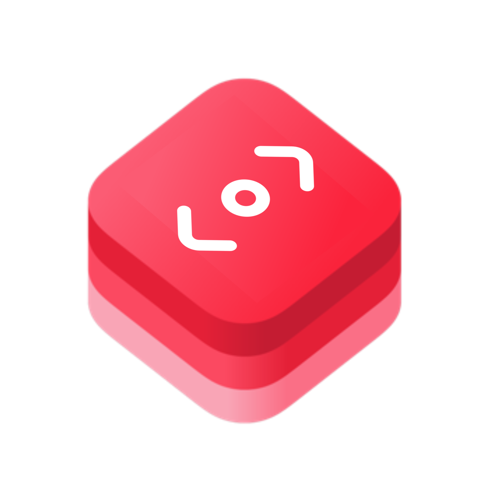

#  Parallax SwiftUI Project

## Overview

Parallax is a SwiftUI-based iOS app that demonstrates a parallax scrolling effect in a travel-themed user interface. This project serves as an educational example of how to create a parallax scroll effect in SwiftUI and can be used as a reference for implementing similar UI interactions in your own applications.

### Key Features

- Parallax scrolling effect in a horizontal card view.
- Search functionality with a magnifying glass icon.
- Travel-themed UI elements for inspiration.

## iTravel Demo App
This package also includes a demo app called "iTravel" that showcases how to integrate and use the Parallax SwiftUI package in a real-world travel-themed application. You can explore the iTravel app to see the package in action and learn how to implement it in your projects.

    
    

## Installation

To run this project locally, you need:

- Xcode 17.0 or later.
- macOS 14.0 or later.
- Swift 5.5.

1. Clone this repository to your local machine using `git clone`.
2. Open the project in Xcode.
3. Build and run the app on the iOS Simulator or a physical device.

## Usage

Feel free to use this project as a reference or starting point for your own SwiftUI projects that require parallax scrolling effects. You can customize and expand upon the code to fit your specific application's needs.

## Contributing

Contributions are welcome! If you have suggestions, bug fixes, or improvements, please open an issue or submit a pull request.

## License

This project is licensed under the MIT License - see the [LICENSE](LICENSE) file for details.

## Acknowledgments

- SwiftUI documentation and community for valuable resources and support.
- Icons used in the project are from the [SF Symbols](https://developer.apple.com/sf-symbols/) library.

## Author

- [Samy Abderraouf Mehdid](https://github.com/RMehdid)

## Contact

If you have any questions or suggestions, feel free to reach out to the project author at [sr.mehdid@gmail.com](mailto:sr.mehdid@gmail.com).
